# Задание 1

- [Высокий приоритет](#высокий-приоритет)
- [Средний приоритет](#средний-приоритет)
- [Низкий приоритет](#низкий-приоритет)

## Высокий приоритет 
### 1. Ложное сообщение "Ничего не нашлось" при наличии результатов
- Описание: На странице отображается сообщение о том, что по запросу ничего не найдено, хотя ниже перечислены найденные вакансии. 
- Приоритет: High.
- Пояснение: Это функциональная ошибка: система одновременно сообщает об отсутствии результатов, но показывает их. Ошибка затрагивает основной сценарий (поиск вакансий).

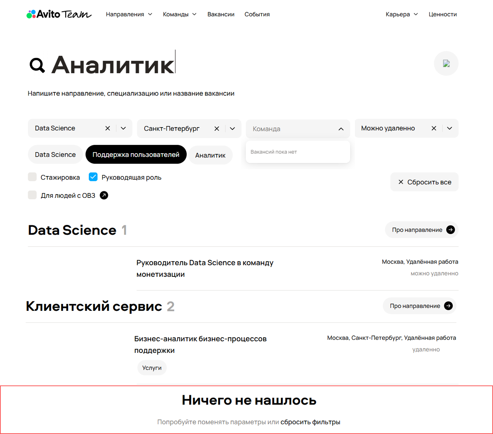

### 2. Несоответствие счётчика вакансий фактическому числу
- Описание: В разделе "Клиентский сервис" заявлено 2 вакансии, однако фактически отображается только одна позиция. 
- Приоритет: High.
- Пояснение: Это функциональная ошибка отображения результатов: счётчик и фактическая выдача не совпадают. 

* Если вакансии нет, а ошибается только счётчик (UI-ошибка без потери данных), то приоритет Medium

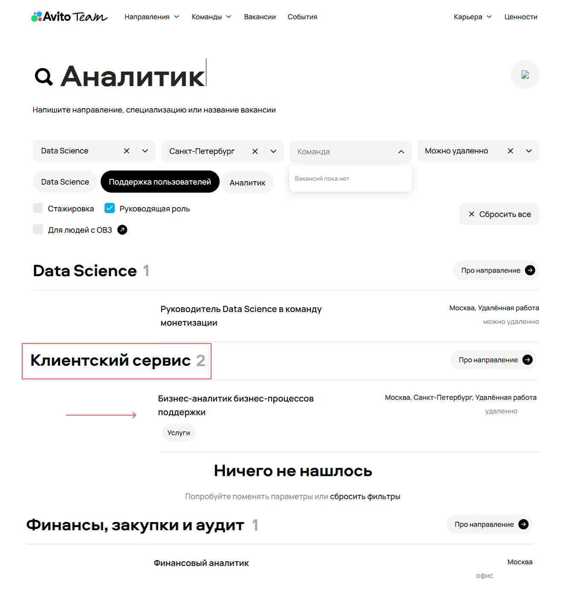

### 3. Несоответствие тегов направлений у вакансий
- Описание: У списка вакансий не соответствуют метки направлений. Вакансия "Руководитель аналитики в транзакционное направление жилой недвижимости" помечена тегом "Авто", хотя по смыслу должна относиться к недвижимости. Следующая вакансия, содержащая "Авито Авто" имеет тег "Недвижимость". 
- Приоритет: High.
- Пояснение: Система присваивает неправильные теги, из-за чего нарушается логика фильтрации по направлениям. Пользователь, опираясь на тег, получает неверную информацию о принадлежности вакансии.

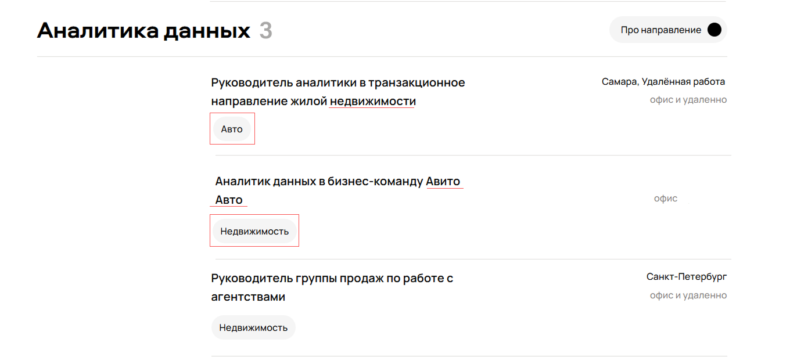

### 4. Некорректная работа фильтрациия по городу
- Описание: В списке отображаются вакансии с локациями Москва и Самара, хотя установлен фильтр Санкт-Петербург.
- Приоритет: High.
- Пояснение: Некорректная работа фильтра по городу приводит к нерелевантной выдаче и ломает пользовательский сценарий (найти вакансии в нужном городе).

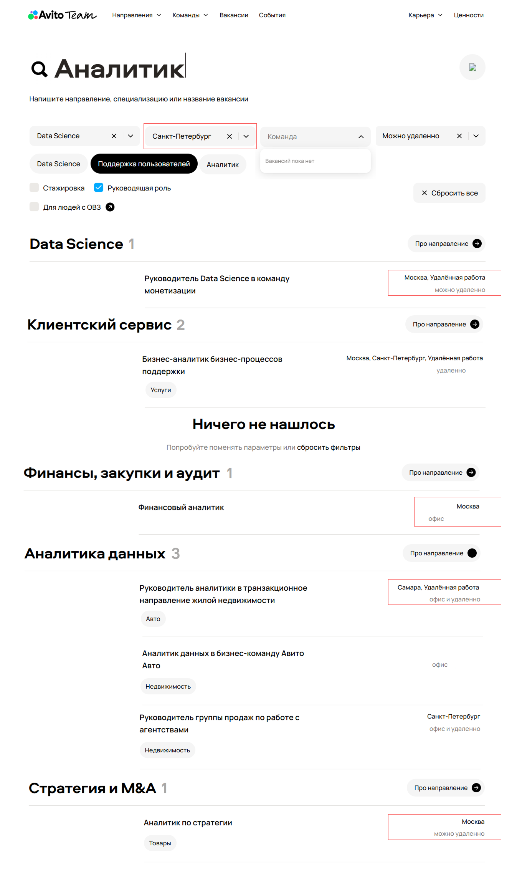

### 5. Некорректная работа фильтрации по руководящей роли
- Описание: В результатах отображаются вакансии, которые не относятся к руководящим позициям и не соответствуют выбранному фильтру.
- Приоритет: High.
- Пояснение: Некорректная работа фильтра по руководящей роли ломает ключевую функциональность фильтрации (выдача не соответствует заданному критерию).

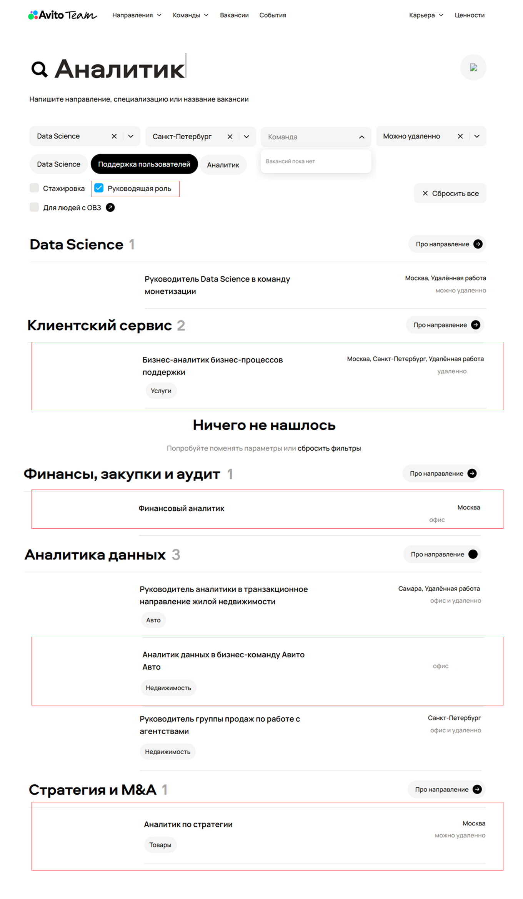

### 6. Некорректная работа поиска по ключевому слову
- Описание: В результатах поиска отображаются вакансии, в названии которых нет ключевого слова "аналитик".
- Приоритет: High.
- Пояснение: Некорректная работа поиска по ключевому слову приводит к нерелевантным результатам.

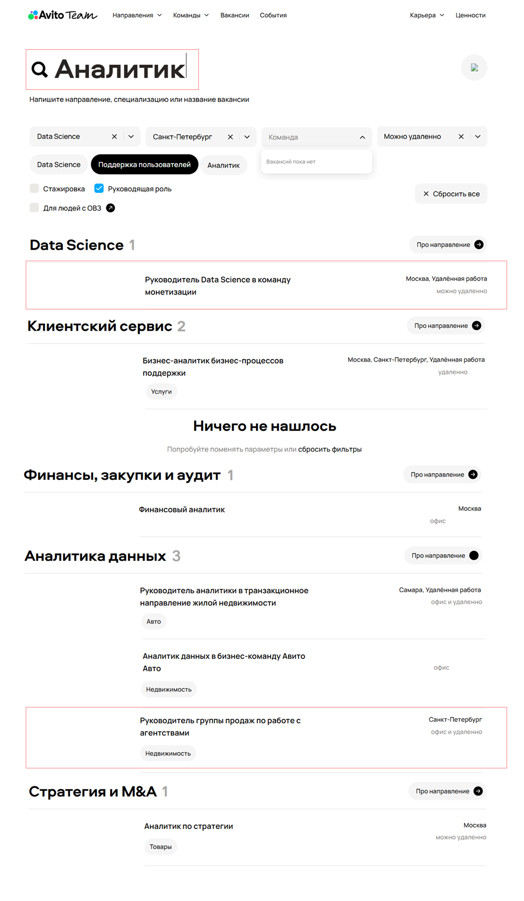

### 7. Некорректная работа фильтрации по тегу "Поддержка пользователей"
- Описание: В выдаче отображаются вакансии, не относящиеся к поддержке пользователей.
- Приоритет: High.
- Пояснение: Некорректная работа фильтра ломает пользовательский сценарий (поиск вакансий в конкретном направлении), приводит к нерелевантным результатам.

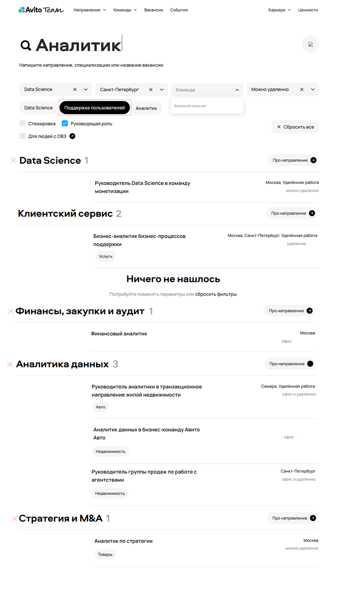

### 8. Некорректная работа фильтрации по формату работы
- Описание: В результатах отображаются вакансии с офисным форматом работы при установленном фильтре "Можно удаленно".
- Приоритет: High.
- Пояснение: Фильтрация работает некорректно, выдача не соответствует выбранному критерию.

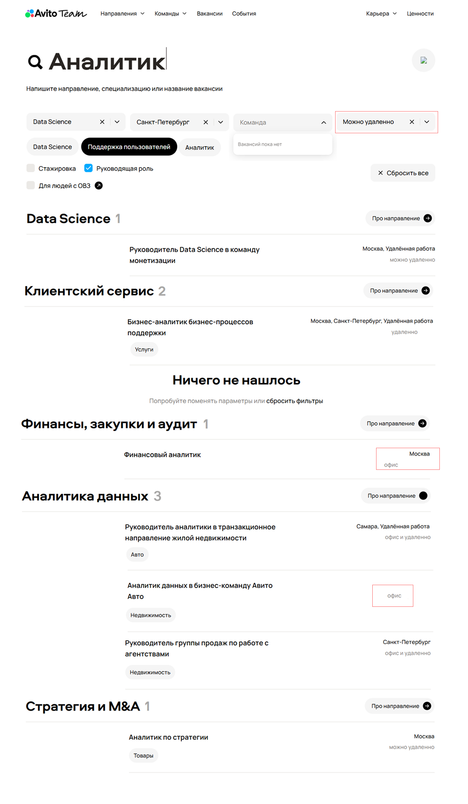

### 9. Некорректное отображение фильтра "Команда" ("Вакансий пока нет")
- Описание: В блоке фильтра "Команда" отображается текст "Вакансий пока нет", создающий впечатление, что по текущим условиям нет вакансий ни в одной команде. При этом ниже на странице есть вакансии в выдаче, то есть данные противоречат состоянию фильтра.
- Приоритет: High.
- Пояснение: Фильтр сообщает об отсутствии вакансий в командах, хотя фактически вакансии есть.

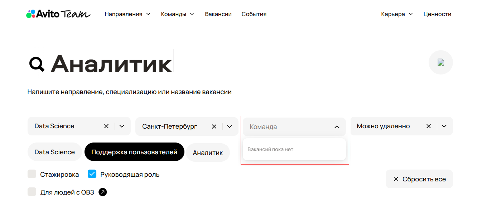

## Средний приоритет 

### 1. Не отображается иконка кнопки очистки поля ввода
- Описание: В правой части поля ввода не отображается корректная иконка кнопки очистки.
- Приоритет: Medium.
- Пояснение: Приоритет средний, так как на функционал не влияет, но ухудшается UX.

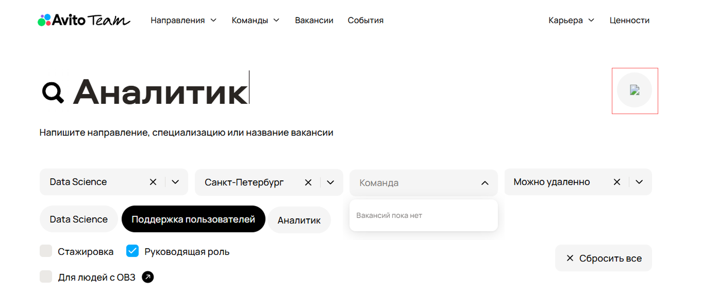

### 2. Частично не отображается информация о городе и формате работы в карточках вакансий
- Описание: В вакансии "Аналитик данных в бизнес-команду Авито Авто" справа отображается только формат "офис", при этом город не указан. В других карточках эти данные отображаются, то есть поведение неконсистентно.
- Приоритет: Medium.
- Пояснение: Ошибка отображения данных в UI: она заметно ухудшает UX, но не блокирует основной сценарий.

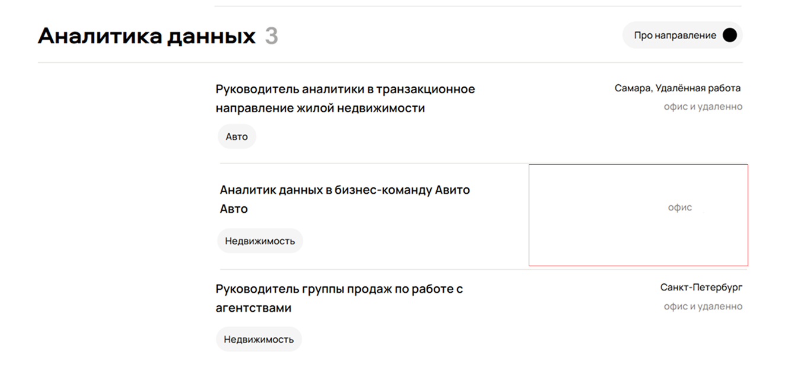

### 3.Неконсистентная иконка у кнопки "Про направление"
- Описание: В заголовках разделов справа есть кнопка "Про направление" с иконкой-стрелкой. Но у раздела "Аналитика данных" иконка отличается от остальных и выглядит как другое состояние/другая кнопка.
- Приоритет: Medium.
- Пояснение: Влияет на UX (снижается понятность интерфейса), но не блокирует сценарии.

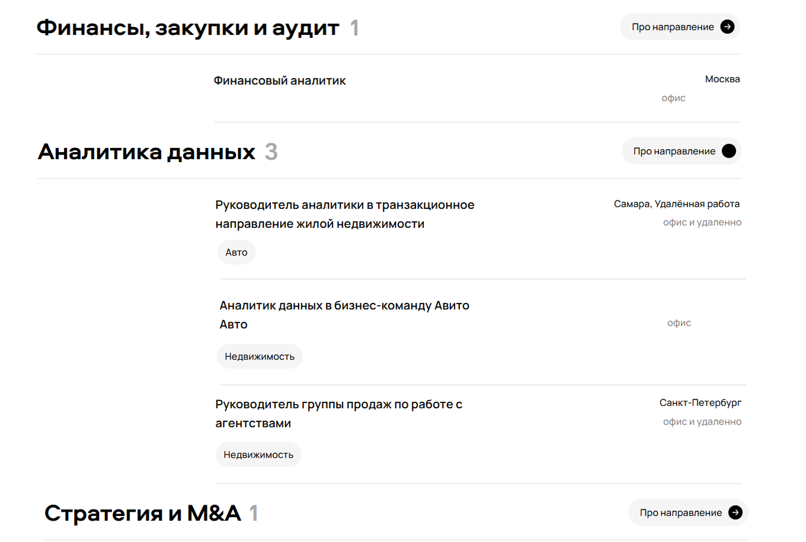

### 4.Дублирование информации о формате работы в карточках
- Описание: В строке локации указано "Москва, Удалённая работа" и ниже отдельной серой строкой снова "можно удаленно". 
- Приоритет: Medium.
- Пояснение: Не функциональная ошибка, но UX-дефект, так как дублирование перегружает карточку.

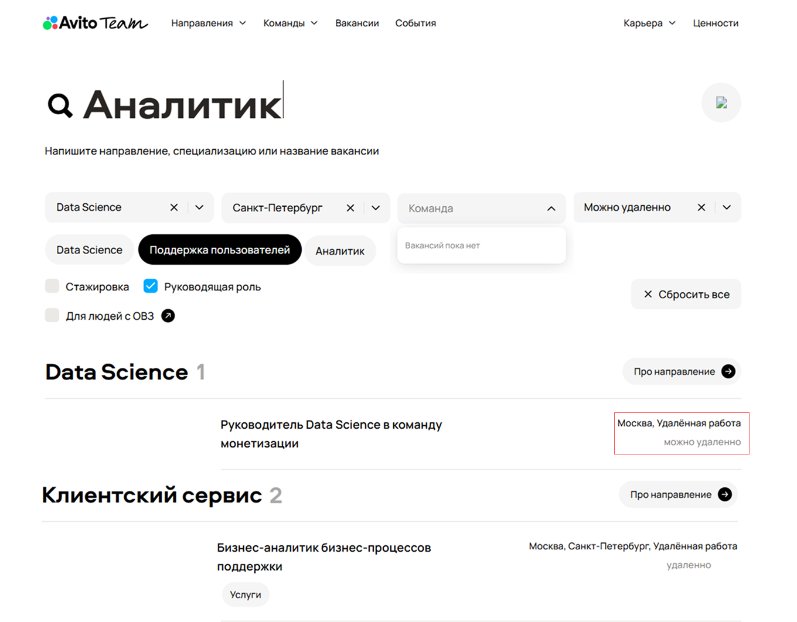

## Низкий приоритет 

### 1. Грамматическая ошибка "227 вакансии открыто"
- Описание: Должна использоваться форма "227 вакансий открыто" (множественное число в родительном падеже).
- Приоритет: Low.
- Пояснение: На функциональность не влияет, проблема затрагивает только восприятие.

 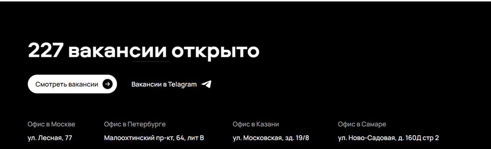

### 2. Несоответствие названий одной и той же области
- Описание: В разных местах используются разные термины для одной и той же области. В верхней панели фильтров направление называется "Поддержка пользователей", а в результатах поиска заголовок категории - "Клиентский сервис".
- Приоритет: Low.
- Пояснение: На функциональность не влияет, но может запутать пользователя.

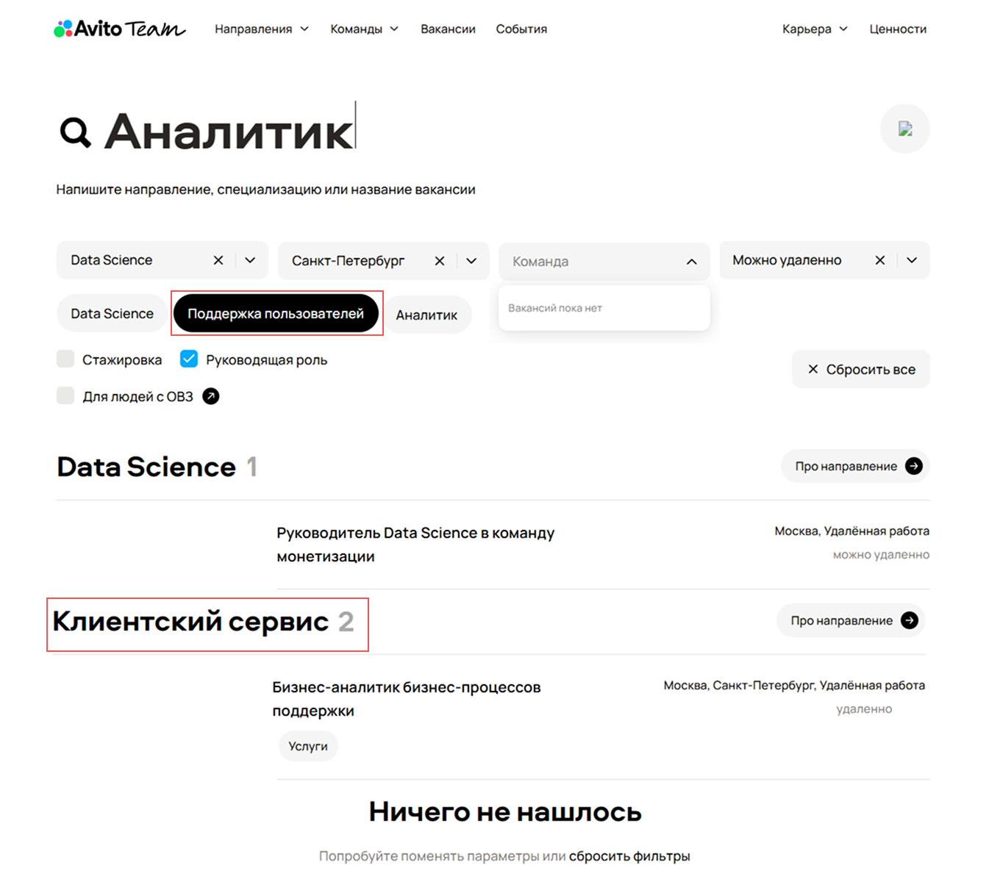

 ### 3. Некорректный текст в фильтре "Команда"
- Описание: В пустом состоянии фильтра "Команда" должен быть текст, отражающий именно отсутствие подходящих команд для уже заданных пользователем условий фильтрации, а не отсутствие вакансий. 
- Приоритет: Low.
- Пояснение: Логическая ошибка в тексте, но на функциональность никак не влияет.

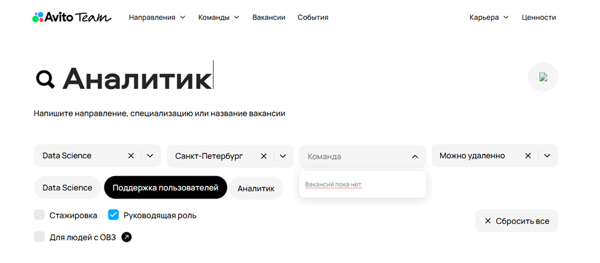

### 4. Опечатка в футере 
- Описание: Опечатка в футере "Вакансии в Telagram".
- Приоритет: Low.
- Пояснение: Приоритет низкий, так как по иконке пользователь поймет о чем речь.

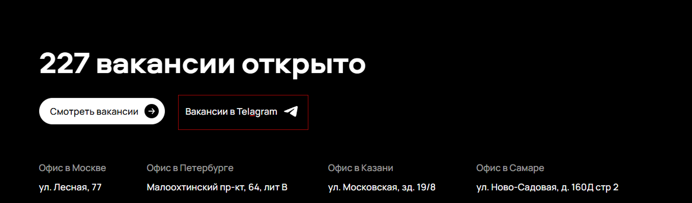

### 5. Разное выравнивание в выравнивании 
- Описание: Разное выравнивание формата работы в карточках вакансий.
- Приоритет: Low.
- Пояснение: Низкий приоритет, так как влияет на UI, но не на восприятие пользователем информации.

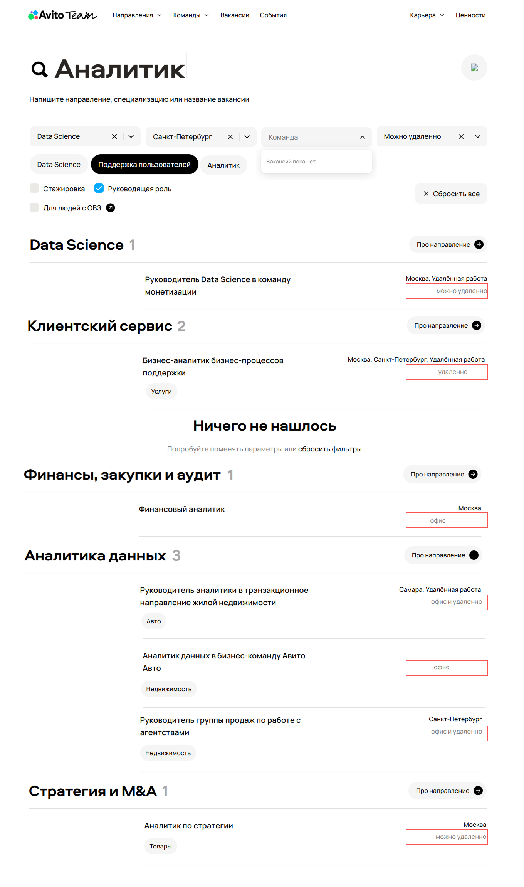

### 6.Опечатка в адресе московского офиса
- Описание: В адресе московского офиса указано "ул. Лесная, 77", должно быть "ул. Лесная, 7" (остальные адреса соответствуют фактическим).
- Приоритет: Low.
- Пояснение: Ошибка не влияет на работу сайта, но может вводить пользователей в заблуждение.

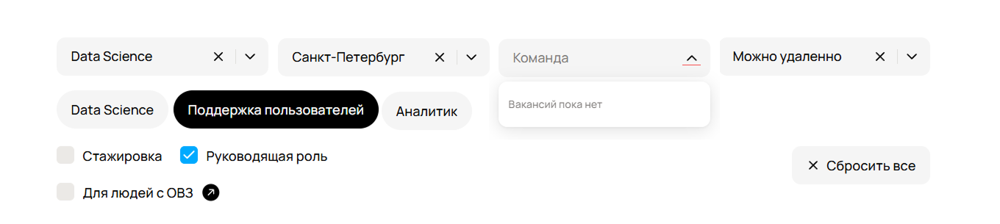

### 7.Некорректное состояние стрелки у фильтра "Команда" при пустом состоянии
- Описание: Так как "Вакансий пока нет" - это не значение фильтра и не список категорий, а сообщение о пустом состоянии, стрелка должна оставаться в положении вниз. То есть визуальное состояние стрелки должно соответствовать реальному состоянию фильтра.
- Приоритет: Low.
- Пояснение: Ошибка не влияет на функционал, но создаёт некорректный визуальный сигнал.

